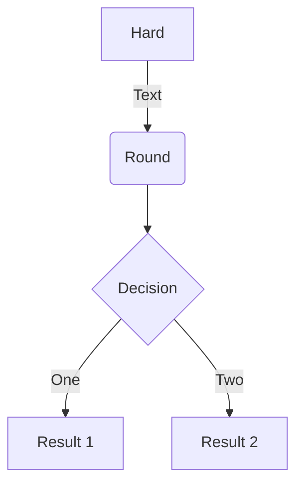
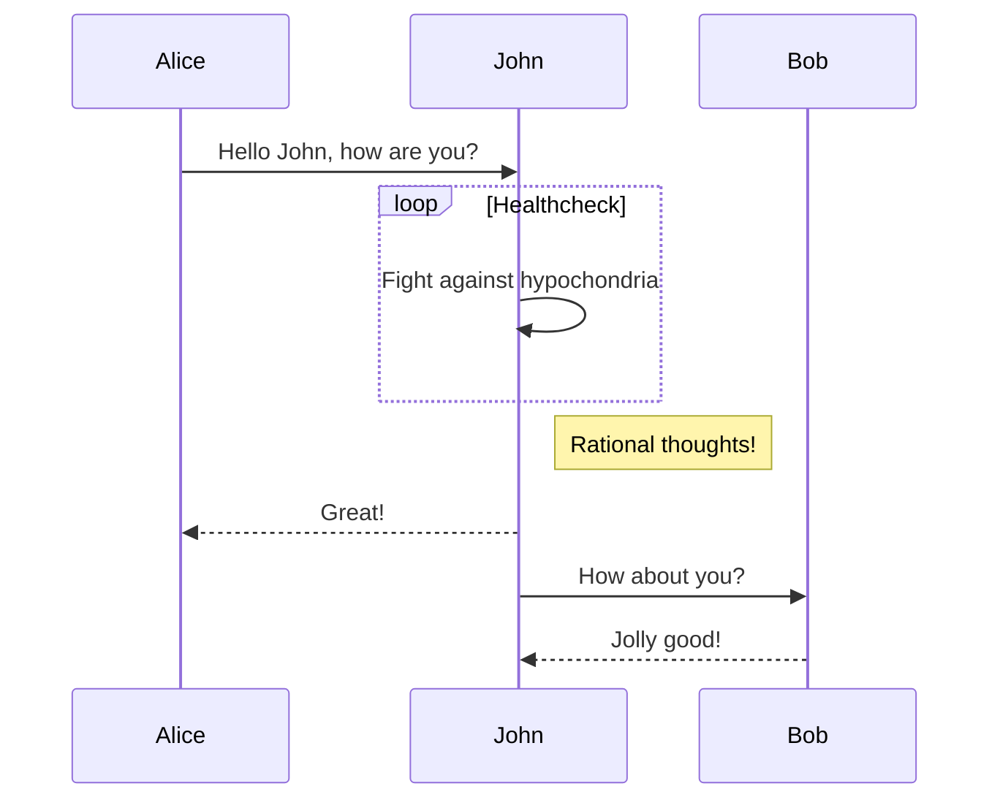
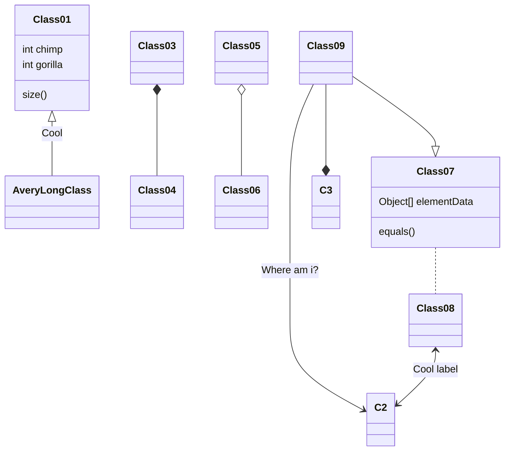
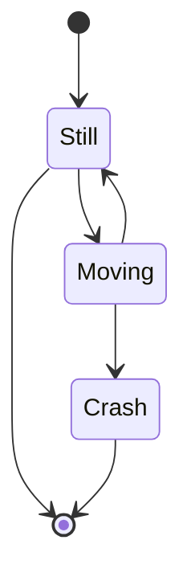

In the era of Internet of Things (IoT), managing and analyzing massive amounts of sensor data presents unique challenges. This post explores some of the key techniques and approaches we use in our research.

## Challenges in IoT Data Analytics

IoT systems generate continuous streams of data from multiple sensors, creating several challenges:

1. **Data Quality Issues**: Sensor data can be noisy, incomplete, or erroneous
2. **Volume and Velocity**: Massive amounts of data generated at high speed
3. **Heterogeneity**: Different types of sensors with varying data formats
4. **Real-time Processing**: Need for immediate analysis and decision-making

## Our Approach to Data Quality Control

In our research project "IoT Data Quality Control for Smart Home Systems," we developed machine learning-based approaches to automatically:

- **Detect anomalies** in sensor readings
- **Clean dirty data** in real-time
- **Impute missing values** intelligently
- **Validate data consistency** across multiple sensors

## Machine Learning Techniques

We employ various ML techniques including:

- **Supervised Learning**: For classification and prediction tasks
- **Unsupervised Learning**: For anomaly detection and pattern discovery
- **Deep Learning**: For complex feature extraction and pattern recognition
- **Fuzzy Logic**: For handling uncertainty in sensor data

## Real-world Applications

Our research has been applied to:

- Smart home energy management systems
- Healthcare monitoring systems
- Renewable energy optimization
- Industrial IoT systems

## Future Directions

The future of IoT data analytics lies in:

- Edge computing for real-time processing
- Federated learning for privacy-preserving analytics
- Explainable AI for transparent decision-making
- Integration with 5G and beyond

If you're interested in collaborating on IoT data analytics research, please feel free to reach out!

Hugo Blox supports the _Mermaid_ Markdown extension for diagrams.

An example **flowchart**:

    ```mermaid
    graph TD
    A[Hard] -->|Text| B(Round)
    B --> C{Decision}
    C -->|One| D[Result 1]
    C -->|Two| E[Result 2]
    ```

renders as



An example **sequence diagram**:

    ```mermaid
    sequenceDiagram
    Alice->>John: Hello John, how are you?
    loop Healthcheck
        John->>John: Fight against hypochondria
    end
    Note right of John: Rational thoughts!
    John-->>Alice: Great!
    John->>Bob: How about you?
    Bob-->>John: Jolly good!
    ```

renders as



An example **class diagram**:

    ```mermaid
    classDiagram
    Class01 <|-- AveryLongClass : Cool
    Class03 *-- Class04
    Class05 o-- Class06
    Class07 .. Class08
    Class09 --> C2 : Where am i?
    Class09 --* C3
    Class09 --|> Class07
    Class07 : equals()
    Class07 : Object[] elementData
    Class01 : size()
    Class01 : int chimp
    Class01 : int gorilla
    Class08 <--> C2: Cool label
    ```

renders as



An example **state diagram**:

    ```mermaid
    stateDiagram
    [*] --> Still
    Still --> [*]
    Still --> Moving
    Moving --> Still
    Moving --> Crash
    Crash --> [*]
    ```

renders as



## Data Frames

Save your spreadsheet as a CSV file in your page's folder and then render it by adding the _Table_ shortcode to your page:

```go

```

renders as



## Interactive Buttons

Add engaging call-to-action buttons to your data visualization posts:

### Basic Buttons

Contact Us

&nbsp;

Learn Plotly

```go-html-template
Contact Us

Learn Plotly
```

### Styled Buttons for Data Actions

View Dashboard

&nbsp;

Download Data

&nbsp;

View Source Code

```go-html-template
View Dashboard

Download Data

View Source Code
```

### Multiple Aligned Buttons

Try Jupyter

&nbsp;

Open in Colab

```go-html-template
Try Jupyter

Open in Colab
```

## Did you find this page helpful? Consider sharing it 🙌
